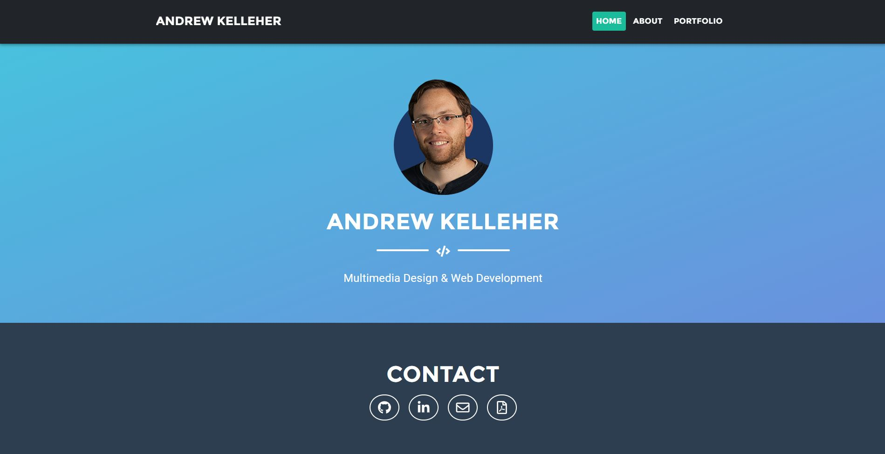

# Portfolio

## Description 
  For this project, I created an updated version of my Portfolio with some actual examples plus a resume.

    
    

  ---
  ## Table of Contents

  * [Installation](#installation)
  * [Credits](#credits)
  * [License](#license)
  * [Questions](#questions)

  ---
  ## Installation 
  This page is hosted on Git Pages, no installation required.  
Project deployed: http://diemrbond.github.io

  
  ---
  ## Credits 
Thanks to the following for contributing to this project: 

Bootstrap & https://startbootstrap.com/

  ---
  ## License 
  This application is licensed under: No license
  

  
  ---
  ## Questions
  If you have any questions about this project, please feel free to contact me via the following information:

  

  Andrew Kelleher

  Github: https://github.com/diemrbond

  Email: [mrbondmustdie@gmail.com](mailto:mrbondmustdie@gmail.com)

  ---
  © 2020 Andrew Kelleher | http://diemrbond.github.io
